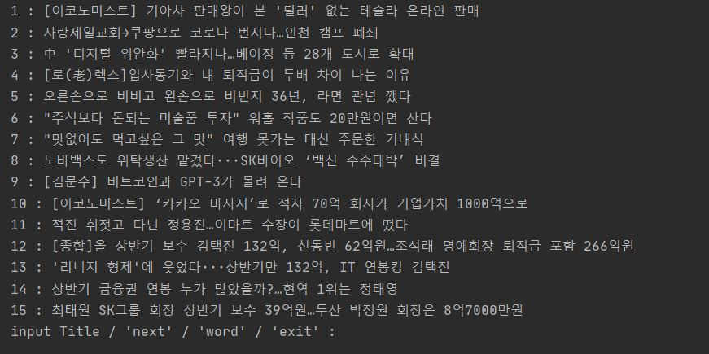
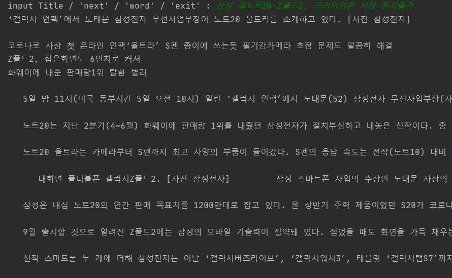
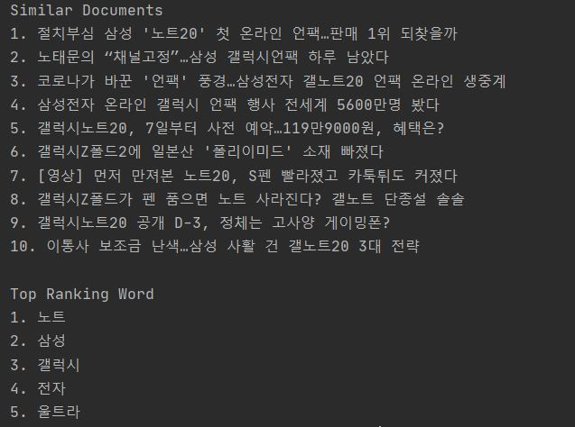
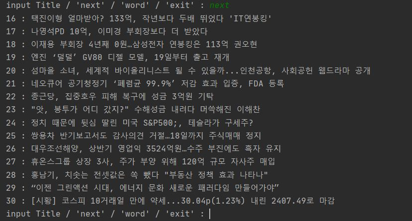
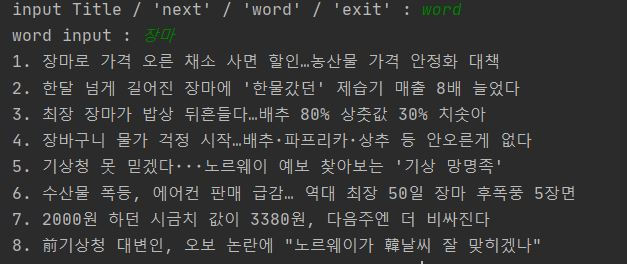

<h1>Document Recommendation Program Using Similarity Test</h1>

<!-- TABLE OF CONTENTS -->

## Table of Contents

- [About the Project](#about-the-project)
- [Usage](#usage)
  - [Program](#Program)
  - [Web](#Web)
  - [precautions](#precautions)

# About The Project

Document Recommendation Program Using Similarity Test 
This program is applicable to all documents with title and contents.
I used economic news as an example.

# Usage

## Program

run main.py 

<h3>Input Title / 'next' / 'word' / 'exit' :</h3>

1. Enter the title of the document to see the content of the document, documents similar to this document, and words that have been used a lot. 
   
   
    

2. Type 'next' to view a list of news on the next page. One page shows 15 document. 
   
    

3. Type 'word' to see documents that use that word a lot. Show only documents with three or more words. 
    

4. If you want to end the program, type 'exit'.
  

## Web

run main_web.py 

 

1. CLICK the title of the article to see the content of the article, articles similar to this article, and words that have been used a lot. 
2. CLICK next or back button to see another page. One page shows 15 articles. 
3. If you search the input box at the top, you can see documents where the word is used a lot. Show only documents with three or more words.
    

### precautions

If you don't have forsearchword.txt, run forSearchWord.py and then main.py or main_web.py
The process of extracting words from all articles to search for words took too long.
So I used forSearchWord.py to put the list in a txt file.
By reading the txt file and getting the list, I was able to shorten the execution time.
