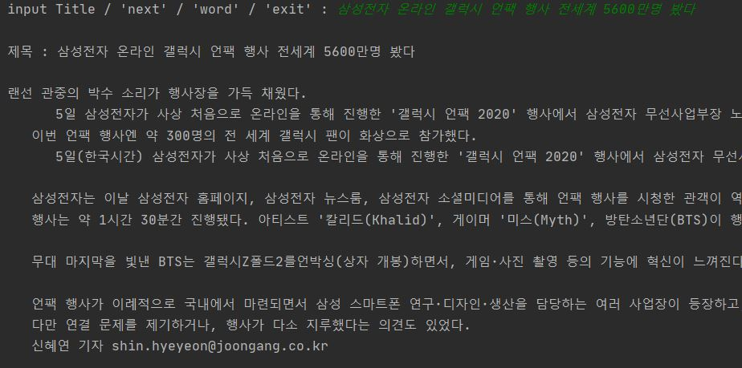

<h1>Document Recommendation Program Using Similarity Test</h1>

<!-- TABLE OF CONTENTS -->

## Table of Contents

- [About the Project](#about-the-project)
- [Usage](#usage)
  - [Program](#Program)
  - [Web](#Web)
  - [precautions](#precautions)

# About The Project

Document Recommendation Program Using Similarity Test 
This program is applicable to all documents with title and contents.
I used economic news as an example.

# Usage

## Program

run main.py 

<h3>Input Title / 'next' / 'word' / 'exit' :</h3>

1. Enter the title of the document to see the content of the document, documents similar to this document, and words that have been used a lot. 
    (중략) 
   
    

2. Type 'next' to view a list of news on the next page. One page shows 15 document. 
   
    

3. Type 'word' to see documents that use that word a lot. Show only documents with three or more words. 
    

4. If you want to end the program, type 'exit'.
  

## Web

run main_web.py 

